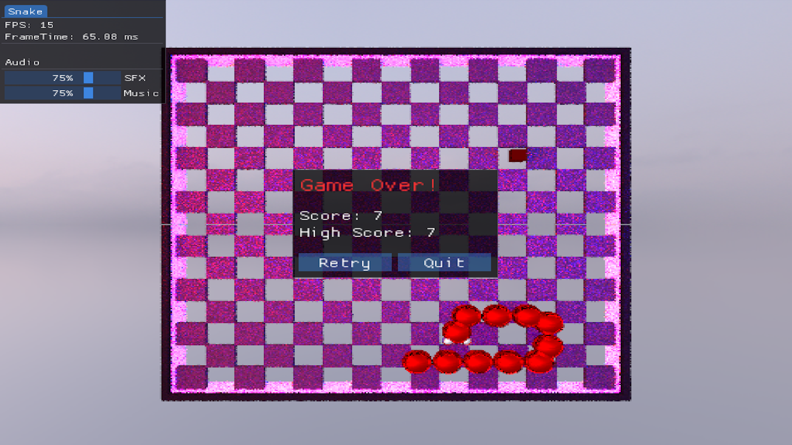

## **Viridian Serpent**

Viridian Serpent is a voxel-based ray tracer built on the CPU, featuring a playable 3D Snake game integrated into the renderer

---

#### Rendering Features:
- Point Lights, Spot Lights and Area Lights
- Progressive rendering with an accumulator: Reduces noice gradually over time using blue noise
- Reprojection: Blends previous frame with current frame to reduce noise
- Material support: Roughness, IOR, Specular, Metallic and Transparent
- Supports loading in '.vox' and '.bin' assets
- Ray traced Spheres
- Advanced ImGui debug menu which allows you to add / modify / delete voxels, light sources and spheres

---

#### Controls: 
- Movement: WASD
- Toggle ImGui Menu: F3
- Toggle Developer Menu: F5

---

#### Dependencies: 
Viridian Serpent is built on top of [voxpopuli](https://github.com/jbikker/voxpopuli) and is created and provided by [Jacco Bikker](https://jacco.ompf2.com/)  
imgui can be downloaded [here](https://github.com/ocornut/imgui)  
miniaudio.h can be downloaded [here](https://miniaud.io/)  
ogt_vox.h can be downloaded [here](https://github.com/jpaver/opengametools/blob/master/src/ogt_vox.h)

---

#### Credits:
Project could not have been made possible without Jacco Bikker's Blog Series:   ["Ray Tracing with Voxels in C++"](https://jacco.ompf2.com/2024/04/24/ray-tracing-with-voxels-in-c-series-part-1/)